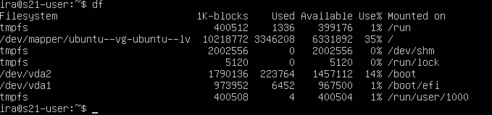

# Операционные системы UNIX/Linux (Базовый).

## Part 1. Установка ОС

На данном скриншоте представлена информация о текущей версии Ubuntu

## Part 2. Создание пользователя

На данном скриншоте представлен вызов команды для добавления нового пользователя и информация о нем из файла passwd

## Part 3. Настройка сети ОС

1. ##### Задай название машины вида user-1  

 
На данном скриншоте представлен вызов команды для установки нового называния машины

2. ##### Установи временную зону, соответствующую твоему текущему местоположению. 

 
На данном скриншоте представлен вызов команды для установки часового пояса, в котором я нахожусь

3. ##### Выведи названия сетевых интерфейсов с помощью консольной команды, дай объяснение наличию интерфейса lo. 

Интерфейс lo (loopback) - по умолчанию присутствует в любой Линукс системе. Используется для отладки и запуска сетевых приложений на локальной машине. При отправке данных на этот интерфейс, они не покидают устройство, но передаются тем же способом, как если бы они пришли извне по сети, что значительно упращает тестирование. Обычный IP-адрес 127.0.0.1, подсеть 255.0.0.0.

4. ##### Используя консольную команду получи ip адрес устройства, на котором ты работаешь, от DHCP сервера, в отчёте дай расшифровку DHCP.

DHCP — протокол прикладного уровня модели TCP/IP, служит для назначения IP-адреса клиенту. Существует несколько способов назначения адреса клиенту:

* Статическое распределение - системный администратор самостоятельно задает нужные соответствия IP для MAC-адресов клиентов на самом DHCP-сервере. IP останется за клиентом, даже если тот выйдет из сети.
* Динамическое распределение - DHCP-сервер назначает адрес из области на определенное время, называемое сроком аренды.
* Автоматическое распределение - Сервер закрепляет IP из области за каждым клиентом навсегда.

5. ##### Определи и выведи на экран внешний ip-адрес шлюза (ip) и внутренний IP-адрес шлюза, он же ip-адрес по умолчанию (gw). 

На данном скриншоте представлен внешний (src <ip>) и внутренний IP адрес (default via <ip>)

6. ##### Задай статичные (заданные вручную, а не полученные от DHCP сервера) настройки ip, gw, dns (используй публичный DNS серверы, например 1.1.1.1 или 8.8.8.8).  

 
Использовала команду **`sudo nano /etc/netplan/00-installer-confit.yaml`** для открытия файла кофигурации и заполнила данные

7. #### Перезагрузи виртуальную машину. Убедись, что статичные сетевые настройки (ip, gw, dns) соответствуют заданным в предыдущем пункте. 

Использовала команду `sudo reboot now` и удостоверилась, что данные заданы статически

8. ##### Успешно пропингуй удаленные хосты 1.1.1.1 и ya.ru и вставь в отчёт скрин с выводом команды.

## Part 4. Обновление ОС

 
Система успешно обновлена

## Part 5. Использование команды **sudo**. В отчёте объясни *истинное* назначение команды sudo (про то, что это слово - «волшебное», писать не стоит). Поменяй hostname ОС от имени пользователя, созданного в пункте [Part 2](#part-2-создание-пользователя) (используя sudo).

 
Имя машины от имени другого пользователя изменено.

sudo - специальная команда, позволяющая выполнять действия от и мени суперпользователя (root). Использование данной команды должно быть с осторожностью, чтобы предотвратить проблемы с безопасностью. В основном используется для установки и обновления программ, административных задач (примеры: настройка сети, изменение системных настроек и др.) и операций с файловой системой. Не следует использовать права суперпользователя для установки программ из ненадежных источнков, неизвестных команд и для действий, нарушающих политику беопасности.

## Part 6. Установка и настройка службы времени

 
На слайде представлен результат требуемой команды и верный результат

## Part 7. Установка и использование текстовых редакторов 

1. ##### Установи текстовые редакторы **VIM** (+ любые два по желанию **NANO**, **MCEDIT**, **JOE** и т.д.)  
Для установки использовались следующие команды:
* sudo apt install vim
* sudo apt install nano
* sudo apt install joe

2. ##### Используя каждый из трех выбранных редакторов, создай файл *test_X.txt*, где X -- название редактора, в котором создан файл. Напиши в нём свой никнейм, закрой файл с сохранением изменений.  
vim: wq
 

 
nano: ^O ^X
 

 
joe: ^k x
 

3. ##### Используя каждый из трех выбранных редакторов, открой файл на редактирование, отредактируй файл, заменив никнейм на строку «21 School 21», закрой файл без сохранения изменений.
vim: q!
 

 
nano: ^X n
 

 
joe: ^c y
 

4. ##### Используя каждый из трех выбранных редакторов, отредактируй файл ещё раз (по аналогии с предыдущим пунктом), а затем освой функции поиска по содержимому файла (слово) и замены слова на любое другое.
vim search: /searched
 

 
vim replace: `:s/old_word/new_word/`
 

 
nano search: ^w
 

 
nano replace: Alt + R, old_word, new_word, y
 

joe search:  ^k ‘searched’ I

joe replace: ^k ‘old’ R ‘new’ y

## Part 8. Установка и базовая настройка сервиса **SSHD**

1. ##### Установи службу SSHd.  

На данном скриншоте представлено потверждение, что служба успешно установлена

2. ##### Добавь автостарт службы при загрузке системы.  

На данном скриншоте представлено потверждение, что настроен автостарт

3. ##### Перенастрой службу SSHd на порт 2022.  

На данном скриншоте представлено потверждение, что новый порт установлен

4. ##### Используя команду ps, покажи наличие процесса sshd. Для этого к команде нужно подобрать ключи.В отчёте объясни значение команды и каждого ключа в ней.

* -F - вывести максимум доступной информации
* -e - все процессы

5. ##### Вывод команды netstat -tan должен содержать  \
`tcp 0 0 0.0.0.0:2022 0.0.0.0:* LISTEN`  \

* Опция <strong>-n</strong> заставляет утилиту выводить адреса, разделенные точками, вместо использования символических сетевых имен.
* Опция <strong>-a</strong> выводит все существующие в ядре интерфейсы
* Опция <strong>-t</strong> показывает TCP соединения

* **Proto**: Показывает тип протокола сетевого соединения.

* **Recv-Q**: указывает, сколько байтов данных ожидает приема на данном соединении. Когда данные приходят по сетевому интерфейсу и передаются в TCP-стек, они помещаются в очередь приема до тех пор, пока приложение или процесс не будет готово их обработать. Если этот номер не равен нулю, это может указывать на то, что приложение не обрабатывает входящие данные достаточно быстро.

* **Send-Q**: Показывает количество байт, которые были отправлены приложением, но еще не подтверждены как полученные другой стороной. Если этот номер высок, это может указывать на проблемы с сетевым соединением или на то, что удаленный хост не обрабатывает входящие данные.

* **Local Address**: Показывает IP-адрес и порт локальной машины, участвующие в соединении. Если вы видите 0.0.0.0 или :::, это означает, что машина принимает соединения на этом порте со всех IP-адресов.

* **Foreign Address**: Показывает IP-адрес и порт удаленной машины, участвующие в соединении. Если здесь стоит 0.0.0.0:* или *:*, это означает, что соединение находится в состоянии ожидания или прослушивания и не подключено к определенному удаленному адресу.

* **State**: Отображает текущее состояние соединения. Например, LISTEN означает, что система ожидает входящих соединений на этом порту, ESTABLISHED означает, что соединение успешно установлено, и данные могут передаваться между хостами.

* В контексте IP-адреса "0.0.0.0" и "0:0:0:0", каждый ноль имеет следующее назначение:

  * **Первый ноль** означает, что адрес находится в сети класса A.
  * **Второй ноль** указывает, что адрес находится в подсети сети класса A.
  * **Третий ноль** указывает на конкретную сеть или хост в этой подсети.
* В контексте "0.0.0.0" в IPv4, он обычно используется для указания нулевого адреса или адреса всех сетей. В сетевом программировании он обозначает "любой IP-адрес" или "любой доступный сетевой интерфейс".

## Part 9. Установка и использование утилит **top**, **htop**

##### Установи и запусти утилиты top и htop.  

- По выводу команды top:
  - __uptime__ - 1:12
  - **`количество авторизованных пользователей`** - 1
  - **`общую загрузку системы`** за последние 1, 5 и 15 минут соответственно - 0.00, 0.00, 0.00
  - **`общее количество процессов`** - 116, 1 запущен, остальные спят
  - **`загрузку cpu`** - 0.0% us (пользовательская), 0.1% sy (системная), 0.0% ni (приоритет), 99.9% id (простой), 0.0% wa (ожидание ввода/вывода), 0.0% hi (аппаратные прерывания), 0.0% si (программные прерывания), 0.0% st (время, украденное у виртуальной машины)
  - **`загрузку памяти`** -  3911.2 MiB всего, 3489,0 MiB свободно, 149.1 MiB использовано, 273.1 MiB буфер/кэш
  - **`pid процесса занимающего больше всего памяти`** - 675 (сортировка по памяти - shift + M)
  - **`pid процесса, занимающего больше всего процессорного времени`** - 1068 (сортировка по времени - shift + f)
- Cкрины с выводом команды htop:
  - **`отсортированному по PID, PERCENT_CPU, PERCENT_MEM, TIME`**
    
    Сортировка по PID
    
    Сортировка по CPU
    
    Сортировка по MEM
    
    Сортировка по TIME
  - **`отфильтрованному для процесса sshd`**
  
  - **`с процессом syslog, найденным, используя поиск`**
  
  - **`с добавленным выводом hostname, clock и uptime`**
  

## Part 10. Использование утилиты **fdisk**

##### Запусти команду fdisk -l.

* название жесткого диска - dev/vda
* размер - 20 GiB
* количество секторов - 41943040
* размер swap - 0В (команда `free -h`)

## Part 11. Использование утилиты **df** 

##### Запусти команду df. 
Отображает список всех файловых систем, занятое и свободное пространство и их размер.

- В отчёте напиши для корневого раздела (/):
  - __размер раздела__ - 10218772
  - __размер занятого пространства__ - 3346208
  - __размер свободного пространства__ - 6331892
  - __процент использования__ - 35%
  - __единицa измерения в выводе__ -  Килобайт

##### Запусти команду df -Th.

- В отчёте напиши для корневого раздела (/):
    - __размер раздела__ - 9.8G
    - __размер занятого пространства__ - 3.2G
    - __размер свободного пространства__ - 6.1G
    - __процент использования__ - 35%
    - __тип файловой системы для раздела__ - ext4

## Part 12. Использование утилиты **du**

##### Выведи размер папок /home, /var, /var/log (в байтах, в человекочитаемом виде)

* __флаг h__ - используется для отображения информации в удобном, для человека, формате.
* __флаг s__ - используется для отображения размера только корневой директории, указанной в опции
##### Выведи размер всего содержимого в /var/log (не общее, а каждого вложенного элемента, используя *)

 
размеры представлены слайде
## Part 13. Установка и использование утилиты **ncdu**

##### Выведи размер папок /home, /var, /var/log.

 
`ncdu /home`
 

 
`ncdu /var`
 

 
`ncdu /var/log`
 

## Part 14. Работа с системными журналами

##### Открой для просмотра:
##### 1. /var/log/dmesg
##### 2. /var/log/syslog
##### 3. /var/log/auth.log  

- Напиши в отчёте время последней успешной авторизации, имя пользователя и метод входа в систему.

Последний вход совершил пользователь Ira, способом pam_unix, 16 января в 22:34.
- Перезапусти службу SSHd.
Использовала команду `sudo systemctl restart sshd`
- Вставь в отчёт скрин с сообщением о рестарте службы (искать в логах).

В отчете видно, что служба была перезапущена в 23:55 16 января

## Part 15. Использование планировщика заданий **CRON**

##### Используя планировщик заданий, запусти команду uptime через каждые 2 минуты.

 
На слайде представлена команда для автоматического запуска uptime каждые 2 минуты. Для этого необходимо вызвать команду `crontab -e`.
 

 
Чтобы вывести список задач для текущего пользователя необходимо вызвать команду `crontab -l`. 
 

 
В syslog представлено подвержение, что команда uptime действительно выполняется каждые 2 минуты.
 

##### Удали все задания из планировщика заданий.

 
Для удаления текущих задач необходимо вызвать команду `crontab -r`. 
 

